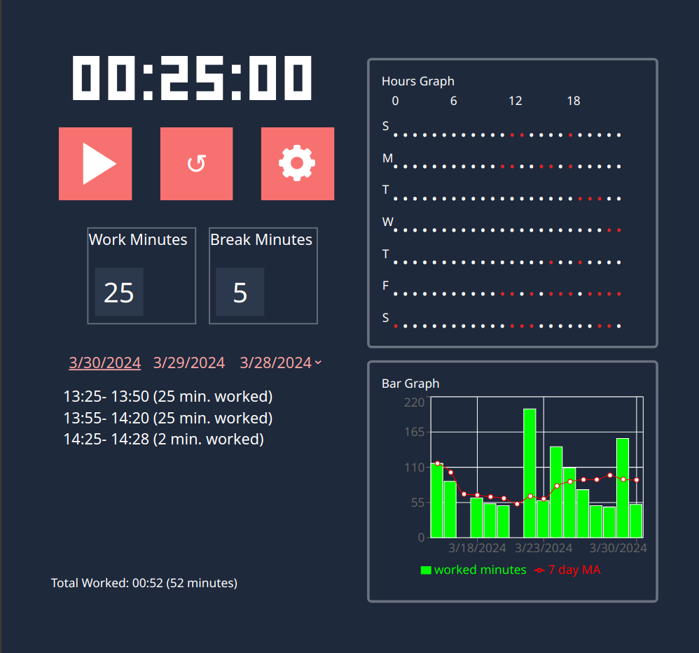

# Pomodoro
This is a basic work tracking app that plays a sound-effect at the end of configurable work sessions and breaks. It also records the previous sessions and displays the work sessions for each date in a date-picker. Also, it has a hours graph, which shows typical working hours in each week-day. Also, it generates a bar graph that plots number of minutes worked at the past at each date as well as 7-day moving average for the amount of work done at each day.



# Installation and Usage
## Github pages
The app can be used directly from [Pomodoro](http://gunaykrgl.github.io/pomodoro)

## Local Installation

```
gh repo clone gunaykrgl/pomodoro
cd pomodoro
npm install
```

Later, the app can be run by

```
npm run dev
```